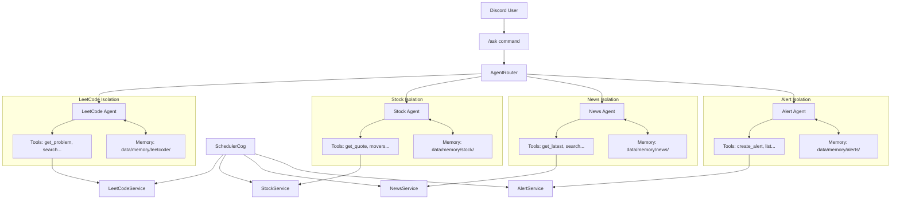
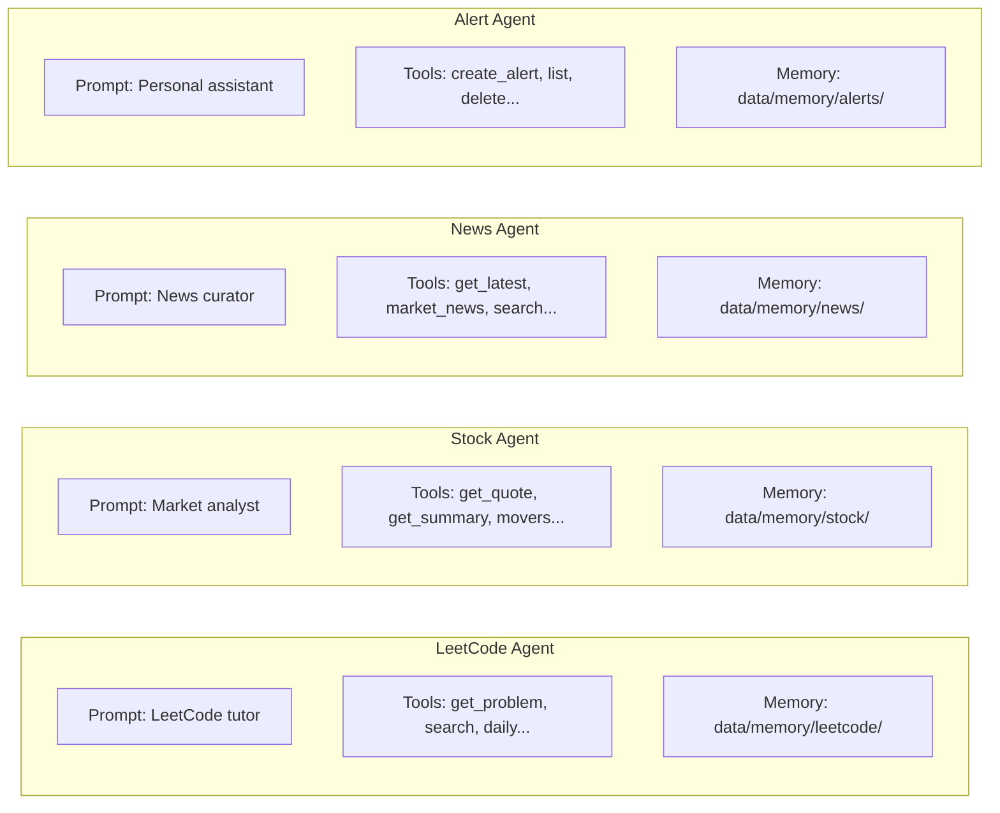

# Multi-Agent Expansion Plan

## Architecture Overview

Refactor the current monolithic `ReActAgent` + `ToolExecutor` into a multi-agent system where each domain has its own isolated agent, tools, and service.




## New Directory Structure

```
agents/
  __init__.py
  base.py            # BaseAgent - generic ReAct loop + memory injection
  router.py          # Routes /ask queries to the correct specialist agent
  leetcode.py        # LeetCode agent: system prompt + tool defs + executor
  stock.py           # Stock agent: system prompt + tool defs + executor
  news.py            # News agent: system prompt + tool defs + executor
  alerts.py          # Alert agent: system prompt + tool defs + executor

services/
  leetcode.py        # (existing, unchanged)
  stock.py           # yfinance wrapper
  news.py            # RSS feed parser (feedparser)
  alerts.py          # Alert CRUD + checking (JSON file storage)
  memory.py          # AgentMemory class - namespace-scoped, per-agent isolation

bot/cogs/
  leetcode.py        # (existing, unchanged)
  stock.py           # /stock commands
  news.py            # /news commands
  alerts.py          # /alert commands
  scheduler.py       # All scheduled tasks consolidated
  ai.py              # /ask with agent routing
```

## Key Components

### 1. `agents/base.py` - BaseAgent

Extract the ReAct loop from [services/ai.py](services/ai.py) into a reusable base class. Each agent instance gets:

- Its own `system_prompt`
- Its own `tool_definitions` list (domain tools + its own memory tools)
- Its own `execute_tool()` dispatch method
- Its own `AgentMemory` instance (namespace-scoped, fully isolated from other agents)
- Shared OpenAI client (single `AsyncOpenAI` instance passed in)

Before each ReAct loop run, BaseAgent automatically:

1. Loads the user's conversation history **from this agent's namespace only**
2. Loads the user's preferences **from this agent's namespace only**
3. Injects both as context into the system prompt
4. After the run completes, saves the exchange to this agent's conversation store

### 2. `agents/router.py` - AgentRouter

Routes `/ask` queries to the right agent using keyword matching with LLM fallback:

- Keywords like "stock", "price", "AAPL", "$" route to StockAgent
- Keywords like "news", "headline", "briefing" route to NewsAgent
- Keywords like "alert", "remind", "due date", "notify me" route to AlertAgent
- Everything else routes to LeetCodeAgent (default)
- If ambiguous, a cheap LLM call classifies the intent

### 3. `services/stock.py` - StockService

Uses `yfinance` (no API key). Methods:

- `get_quote(symbol)` - current price, change, volume
- `get_daily_summary(symbol)` - open/high/low/close, market cap
- `get_movers()` - top gainers/losers (S&P 500 index components)
- `search_symbol(query)` - look up ticker by company name

### 4. `services/news.py` - NewsService

Uses `feedparser` to parse RSS feeds. Methods:

- `get_latest(category, limit)` - latest headlines from configured feeds
- `get_market_news(limit)` - stock/finance-specific news
- `search_news(keyword)` - filter feed entries by keyword

Default RSS sources: Reuters Top News, AP News, MarketWatch, CNBC

### 5. `services/alerts.py` - AlertService

JSON-file persistence in `data/alerts.json`. Alert types:

- **Stock price alert**: trigger when symbol crosses a price threshold (above/below)
- **Due date reminder**: trigger at a specific date/time, with optional repeat

Methods:

- `create_alert(user_id, alert_type, config)` - create a new alert
- `list_alerts(user_id)` - list user's active alerts
- `delete_alert(user_id, alert_id)` - remove an alert
- `check_alerts()` - called by scheduler, returns list of triggered alerts

### 6. `bot/cogs/scheduler.py` - Consolidated Scheduler

Replaces [bot/cogs/daily_notify.py](bot/cogs/daily_notify.py). Single cog with multiple scheduled tasks:

- **Daily LeetCode** (existing logic, migrated)
- **Daily news briefing** - posts morning headlines to configured channel
- **Alert checker** - `tasks.loop(minutes=5)` checks stock prices and due dates, DMs users when triggered

### 7. `bot/cogs/ai.py` - Updated /ask

The `/ask` command uses the router to dispatch to the right agent. Response includes which agent handled the query in the embed footer.

### 8. New Slash Commands

- `/stock quote <symbol>` - quick stock quote
- `/stock summary <symbol>` - detailed daily summary
- `/news latest [category]` - latest headlines
- `/news market` - market/finance news
- `/alert price <symbol> <above|below> <price>` - set stock price alert
- `/alert remind <message> <date>` - set a due-date reminder
- `/alert list` - view your alerts
- `/alert delete <id>` - remove an alert

### 9. `services/memory.py` - AgentMemory

A namespace-scoped memory class. Each agent creates its own `AgentMemory("leetcode")`, `AgentMemory("stock")`, etc. Data is stored in separate directories so agents cannot see each other's history or preferences.

**Storage layout:**

```
data/memory/
  leetcode/
    conversations/{user_id}.json
    preferences/{user_id}.json
  stock/
    conversations/{user_id}.json
    preferences/{user_id}.json
  news/
    conversations/{user_id}.json
    preferences/{user_id}.json
  alerts/
    conversations/{user_id}.json
    preferences/{user_id}.json
```

**Conversation History** (per agent, per user):

- Stores the last N exchanges (question + answer + timestamp)
- Entries older than `MEMORY_TTL_DAYS` are pruned on access
- Capped at `MEMORY_MAX_CONVERSATIONS` per user (default 50)
- The LeetCode agent only sees past LeetCode conversations, stock agent only sees past stock conversations, etc.

**User Preferences** (per agent, per user):

- Key-value store scoped to the agent's domain
- LeetCode agent stores: `{"username": "john", "preferred_difficulty": "Medium"}`
- Stock agent stores: `{"watchlist": ["AAPL", "TSLA"], "default_market": "US"}`
- News agent stores: `{"topics": ["tech", "AI"], "preferred_sources": ["reuters"]}`
- Alert agent stores: `{"timezone": "US/Eastern", "quiet_hours": "22-07"}`
- Each key expires after `MEMORY_TTL_DAYS` unless refreshed

**Per-Agent Memory Tools** (each agent gets its own pair, scoped to its namespace):

- `recall_memory(user_id)` - retrieve this agent's conversations and preferences for the user
- `save_preference(user_id, key, value)` - persist a preference in this agent's namespace

These tools are defined in each agent's module (e.g. `agents/stock.py`) and dispatch to that agent's `AgentMemory` instance. One agent's `save_preference` cannot write to another agent's store.

**TTL and Cleanup:**

- Default TTL: 7 days (configurable via `MEMORY_TTL_DAYS`)
- Stale entries pruned lazily on read
- Scheduler runs periodic cleanup across all namespaces

### 10. Dependencies

Add to [requirements.txt](requirements.txt):

- `yfinance` (stock data)
- `feedparser` (RSS parsing)

### 11. Config

Add to [config.py](config.py):

- `RSS_FEEDS` - dict of category to feed URLs
- `ALERT_CHECK_INTERVAL` - minutes between alert checks (default 5)
- `MEMORY_TTL_DAYS` - how long memories persist (default 7)
- `MEMORY_MAX_CONVERSATIONS` - max conversation entries per user (default 50)

## Agent Isolation

Each agent is fully sandboxed with three layers of isolation:

1. **Tool isolation** -- each agent has its own `tool_definitions` and `execute_tool` dispatcher; it can only call tools for its own domain
2. **Memory isolation** -- each agent has its own `AgentMemory` namespace; conversation history and preferences are stored in separate directories on disk
3. **Prompt isolation** -- each agent has its own system prompt tailored to its domain

The LeetCode agent cannot see stock conversations, the stock agent cannot read alert preferences, etc.




